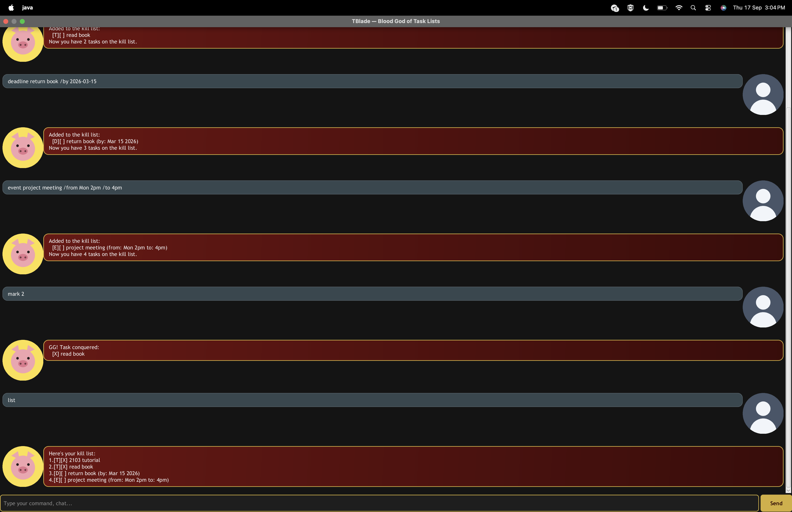

# TBlade User Guide

TBlade is a desktop app for managing your tasks, optimized for use via a Command Line Interface (CLI) while still having the benefits of a Graphical User Interface (GUI). If you can type fast, TBlade can get your task management done faster than traditional GUI apps.

TBlade speaks with a Technoblade-inspired voice: your task list is your **kill list**, and a completed task has been **conquered**. Don't worry, though &mdash; the commands themselves work exactly like any other task-list app.

## Quick start

1. Ensure you have Java 25 installed on your computer.
2. Download the latest `tblade.jar` from [here](https://github.com/imgorf/ip/releases).
3. Copy the file to the folder you want to use as the home folder for TBlade.
4. Open a terminal in that folder and run `java -jar tblade.jar`. A window like the one above should appear in a few seconds. It starts with an empty list &mdash; the tasks shown in the screenshot were added by typing the commands below.
5. Type a command in the input box at the bottom and press Enter (or click **Send**) to run it. Some example commands you can try:
   - `list` &mdash; shows all your tasks.
   - `todo read book` &mdash; adds a todo task.
   - `deadline return book /by 2026-03-15` &mdash; adds a task with a deadline.
   - `delete 1` &mdash; deletes the 1st task shown in the current list.
   - `bye` &mdash; exits the app.
6. Refer to the [Features](#features) below for details of every command.

## Features

**Notes about the command format:**
- Words in `UPPER_CASE` are parameters to be supplied by you, e.g. in `todo DESCRIPTION`, `DESCRIPTION` is a parameter you can supply as `todo read book`.
- Commands are case-sensitive and must be typed in lowercase, e.g. `todo`, not `Todo`.
- Extra leading/trailing spaces around a command are ignored.
- Tasks are saved to disk automatically after every command that changes the list &mdash; there's no separate save command, and nothing is lost when you close the app.
- The task list can hold up to 100 tasks, and an exact duplicate (same task type, description, and any date/time fields) is rejected rather than added twice.

### Adding a todo: `todo`

Adds a task with no date or time attached.

Format: `todo DESCRIPTION`

Example: `todo read book`

### Adding a deadline: `deadline`

Adds a task that must be done by a specific date.

Format: `deadline DESCRIPTION /by DATE`

`DATE` must be in `yyyy-MM-dd` format (e.g. `2026-03-15`).

Example: `deadline submit report /by 2026-03-15`

### Adding an event: `event`

Adds a task that starts and ends at specific times.

Format: `event DESCRIPTION /from START /to END`

`START` and `END` are free text (e.g. a day and time), not restricted to a specific date format.

Example: `event project meeting /from Mon 2pm /to 4pm`

### Listing all tasks: `list`

Shows every task currently on your list, numbered from 1 in the order they were added.

Format: `list`

### Finding tasks: `find`

Shows every task whose description contains the given keyword (case-sensitive, no partial-word matching beyond a plain substring search).

Format: `find KEYWORD`

Example: `find book` matches both `read book` and `return book`.

### Marking a task as done: `mark`

Marks the task at the given position in the currently displayed list as done.

Format: `mark INDEX`

Example: `mark 2` marks the 2nd task shown as done.

### Marking a task as not done: `unmark`

Marks the task at the given position in the currently displayed list as not done.

Format: `unmark INDEX`

Example: `unmark 2` marks the 2nd task shown as not done.

### Deleting a task: `delete`

Deletes the task at the given position in the currently displayed list.

Format: `delete INDEX`

Example: `delete 3` deletes the 3rd task shown.

### Exiting the program: `bye`

Exits TBlade. The console version says goodbye and stops; the GUI window closes shortly after.

Format: `bye`

## FAQ

**Q: How do I transfer my tasks to another computer?**

A: Install TBlade on the other computer, then copy the `data/duke.txt` file created next to your `tblade.jar` and overwrite the one on the other computer.

**Q: Where is my data stored?**

A: In a file at `data/duke.txt`, created automatically in the same folder as `tblade.jar` the first time you add a task. You don't need to create it yourself.

## Command summary

| Action | Format | Example |
|---|---|---|
| Todo | `todo DESCRIPTION` | `todo read book` |
| Deadline | `deadline DESCRIPTION /by DATE` | `deadline submit report /by 2026-03-15` |
| Event | `event DESCRIPTION /from START /to END` | `event meeting /from Mon 2pm /to 4pm` |
| List | `list` | `list` |
| Find | `find KEYWORD` | `find book` |
| Mark | `mark INDEX` | `mark 2` |
| Unmark | `unmark INDEX` | `unmark 2` |
| Delete | `delete INDEX` | `delete 3` |
| Exit | `bye` | `bye` |
